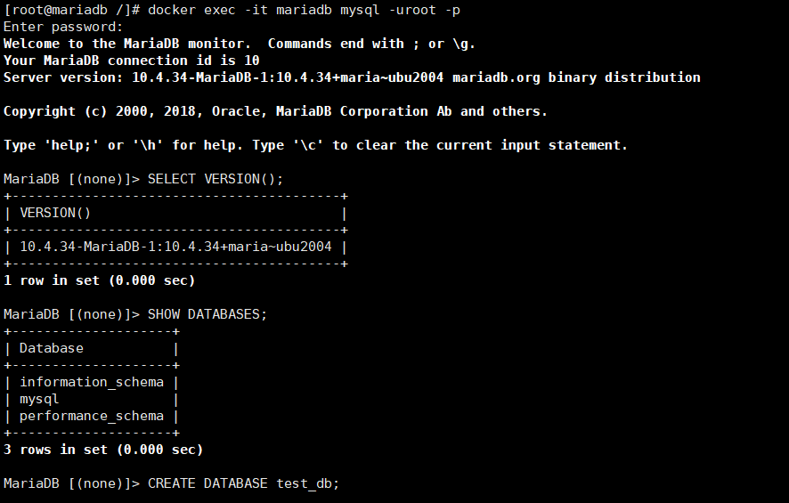
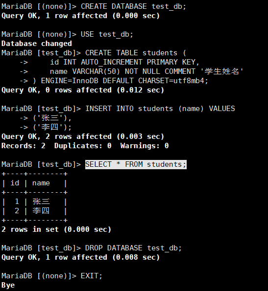

# MariaDB数据库使用指南

# 一、商品链接

[MariaDB数据库](https://marketplace.huaweicloud.com/hidden/contents/ee4ce35a-358b-4463-a583-22e2d06e4990#productid=OFFI1164144698985668608)

# 二、商品说明

MariaDB是一个开源的关系型数据库管理系统，由 MySQL 的创始人 Michael Widenius 主导开发，旨在提供完全兼容 MySQL 的同时，实现更快的开发迭代和更强的扩展性‌。本商品基于鲲鹏服务器的Huawei Cloud EulerOS 2.0 64bit系统，提供开箱即用的Memcached数据可视化平台。

# 三、商品购买

您可以在云商店搜索 **MariaDB数据库**。

其中，地域、规格、推荐配置使用默认，购买方式根据您的需求选择按需/按月/按年，短期使用推荐按需，长期使用推荐按月/按年，确认配置后点击“立即购买”。

# 3.1ECS 控制台配置

### 准备工作

在使用ECS控制台配置前，需要您提前配置好 **安全组规则**。

> **安全组规则的配置如下：**
> - 入方向规则放通端口3306，源地址内必须包含您的客户端ip，否则无法访问
> - 入方向规则放通 CloudShell 连接实例使用的端口 `22`，以便在控制台登录调试
> - 出方向规则一键放通

### 创建ECS

前提工作准备好后，选择 ECS 控制台配置跳转到[购买ECS](https://support.huaweicloud.com/qs-ecs/ecs_01_0103.html) 页面，ECS 资源的配置如下图所示：

选择CPU架构

选择服务器规格

选择镜像

其他参数根据实际请客进行填写，填写完成之后，点击立即购买即可


> **值得注意的是：**
> - VPC 您可以自行创建
> - 安全组选择 [**准备工作**](#准备工作) 中配置的安全组；
> - 弹性公网IP选择现在购买，推荐选择“按流量计费”，带宽大小可设置为5Mbit/s；
> - 高级配置需要在高级选项支持注入自定义数据，所以登录凭证不能选择“密码”，选择创建后设置；
> - 其余默认或按规则填写即可。

# 商品使用

## MariaDB数据库使用

### 容器内连接测试
执行以下命令，连接mariadb，密码mariadb
```bash
docker exec -it mariadb mysql -uroot -p
```

在mariadb命令行内执行
```bash
CREATE DATABASE test_db;  -- 创建测试库
USE test_db;
CREATE TABLE students ( id INT AUTO_INCREMENT PRIMARY KEY,name VARCHAR(50) NOT NULL COMMENT '学生姓名') ENGINE=InnoDB DEFAULT CHARSET=utf8mb4;  -- 建表测试写入权限
INSERT INTO students (name) VALUES  ('张三'), ('李四'); -- 数据写入测试
SELECT * FROM students; -- 查询数据
```



### 参考文档
[Mariadb官网](https://mariadb.org/)
